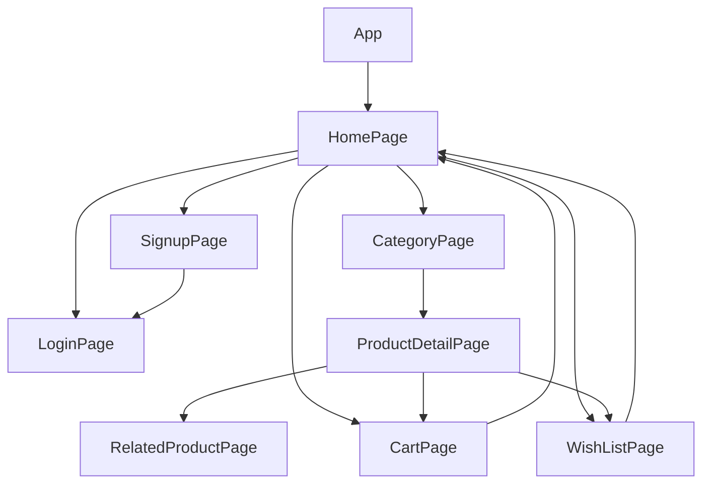

# ✨PROJECT NAME --> ❤️‍🔥❤️‍🔥 Interactive Product Catalog Web Application ❤️‍🔥❤️‍🔥:-

 

---
## 🔗 Profile Links✨

| Resume | Github                                                                                                                                   | Linkedin                                                                                                                                                            | Portfolio                                                                                                                                    | Blogger                                                                                                                                                           | Medium                                                                                                                                    |
| ------------- | ---------------------------------------------------------------------------------------------------------------------------------------- | ------------------------------------------------------------------------------------------------------------------------------------------------------------------- | -------------------------------------------------------------------------------------------------------------------------------------------- | -------------------------------------------------------------------------------------------------------------------------------------------- | -------------------------------------------------------------------------------------------------------------------------------------------- |
|  | |  | | | |  

---
     
# Objective ❤️‍🔥:-

Develop an interactive product catalog web application using React.js and associated libraries to showcase various products. The application allows users to browse through different categories of products, view details of each product, and includes animations/transitions for an enhanced user experience.
---

## Features ✨:-
---
 | Serial No            | Feature                                                              |
| ----------------- | ------------------------
| 1 | User Signup and login, logout, navbar, footer|
| 2 | Home Page Design, responsive design |
| 3 |  Displays categories with thumbnails. |
| 4 | Allows quick navigation to category-specific product pages. |
| 5 |  Displays categories with thumbnails. |
| 6 | Utilizes a responsive grid layout for product display. |
| 7 |   Provides filtering options and pagination for user convenience. |
| 8 |  Offers detailed product information.|
| 9 |   Introduces related products in a popup. |
| 10 | Enables easy addition to cart or wishlist. |
| 11 |   Provides filtering options and pagination for user convenience. |
| 12 | Allows users to manage items with basic functionalities. |
| 13|   Supports adding/removing items, updating quantities, and clearing the cart/wishlist. |
| 14 | Implements smooth transitions and animations for a polished user experience. |
| 15|    Includes hover effects on product thumbnails for interactivity.|
| 16 |Leverages Chakra UI components for a visually consistent design. |
| 17 |   Utilizes theming capabilities for easy customization. |
| 18 | Integrates advanced animations like parallax scrolling. |
| 19 |   Supports user authentication and persistent cart/wishlist storage. |     
| 20 |   User Friendly decent ui  | 
     
----

# Tech Stack ❤️‍🔥:-

React.js: JavaScript library for building user interfaces.

Framer Motion/GSAP: Animation libraries for smooth transitions.

Other Libraries: Any additional libraries used for state management, routing, etc.

---

# Packages Used ❤️‍🔥:-

Create React App: Bootstrapping React applications.

Framer Motion/GSAP: Animation libraries.

React Router: For handling navigation in the application.

----

# Getting Started ❤️‍🔥:-

Clone the repository:-

    git clone https://github.com/your-username/product-catalog.git
    
Navigate to the project directory:-

    cd product-catalog

Install dependencies:-

    npm install
    
Start the development server:-

    npm start
    Open the application in your browser at http://localhost:3000.

Deployed Application:-

      The live version of the application is deployed on Netlify/Vercel.

---

## Flow

Contributing

     💻 Contributions are welcome! Please follow the standard guidelines for contributing.
---

<h1 align = "center">❤️‍🔥 THANK YOU ❤️‍🔥</h1>
